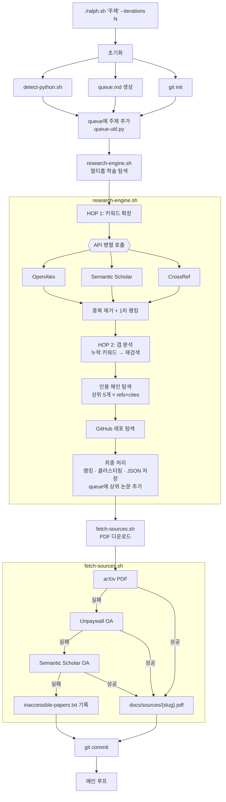
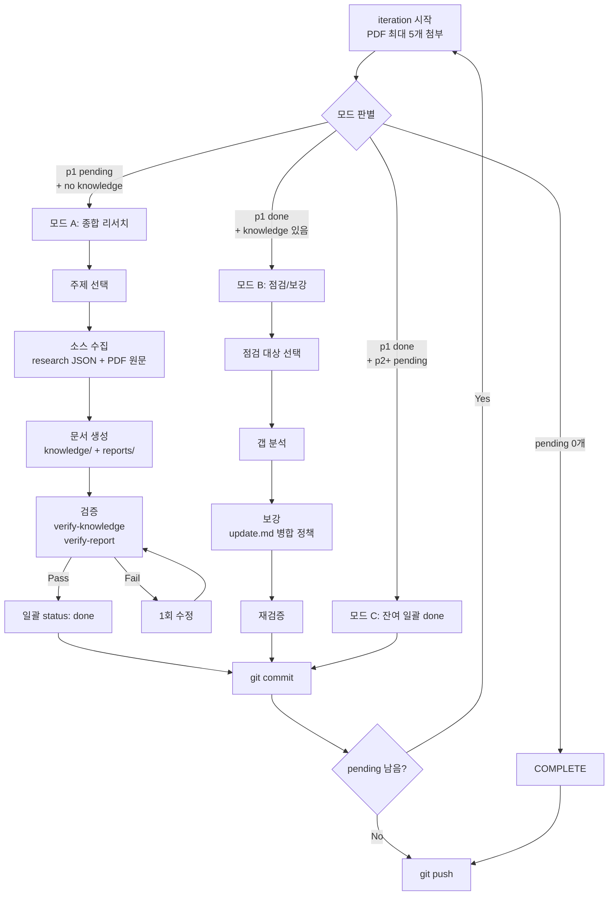
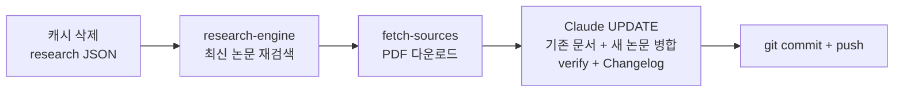
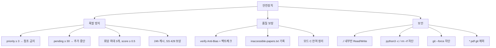

# Research Loop

학술 논문 자동 탐색 → PDF 다운로드 → 지식DB/보고서 생성 파이프라인.
bash + embedded Python heredoc 패턴. Windows(Git Bash) 환경.

## 파이프라인 흐름



## 모드 판별 & 처리



## --update 모드



## 안전장치



## 파일 구조

```mermaid
flowchart LR
    subgraph root["루트 (스크립트)"]
        ralph.sh
        research-engine.sh
        fetch-sources.sh
        detect-python.sh
        queue-util.py
    end

    subgraph prompts["prompts/ (Claude 지침)"]
        PROMPT.md
        add-knowledge.md
        verify-knowledge.md
        verify-report.md
        update.md
    end

    subgraph ref["ref/ (참조 문서)"]
        CONVENTIONS.md
        PIPELINE.md
        DEBUG.md
    end

    subgraph docs["docs/ (자동 생성)"]
        research/"JSON 24h 캐시"
        sources/"PDF 로컬만"
        knowledge/"AI 지식DB"
        reports/"사람용 보고서"
    end
```

## 필수 규칙
1. **인코딩**: 모든 python3 호출에 `PYTHONIOENCODING=utf-8 PYTHONUTF8=1 python3 -X utf8`. 파일 I/O에 `encoding="utf-8"`.
2. **파이프 서브쉘 금지**: `echo | while`에서 부모 함수 미상속 → 임시 파일 + `while read < file` 사용.
3. **bash 변수 대용량 텍스트 금지**: `$(cat file.md)` 직접 읽기. 변수 캐싱 X.
4. **heredoc exit**: `sys.exit()` 대신 `os._exit(0)` 사용.
5. **API None 방어**: SS 응답 모든 레벨에서 `isinstance` 체크 + 개별 `try/except`.
6. **Queue 폭발 방지**: priority≥3 금지, pending≥30 중단, 회당 최대 3개, score≥0.5 필터.

## 참조 문서
| 문서 | 내용 |
|------|------|
| [ref/CONVENTIONS.md](ref/CONVENTIONS.md) | 코딩 컨벤션, API 패턴, 안전장치 상세 (코드 예시 포함) |
| [ref/PIPELINE.md](ref/PIPELINE.md) | ASCII 아키텍처 다이어그램, 파일 생성 맵 |
| [ref/DEBUG.md](ref/DEBUG.md) | 환경/API/Queue/Git/Claude 문제 해결, 진단 체크리스트 |
| [README.md](README.md) | 실행 방법, 옵션, 요구사항 |

## 실행
```bash
./ralph.sh "주제" --iterations 3   # 새 리서치
./ralph.sh "주제" --update          # 최신화
./ralph.sh --run 5                  # queue 이어서
```
